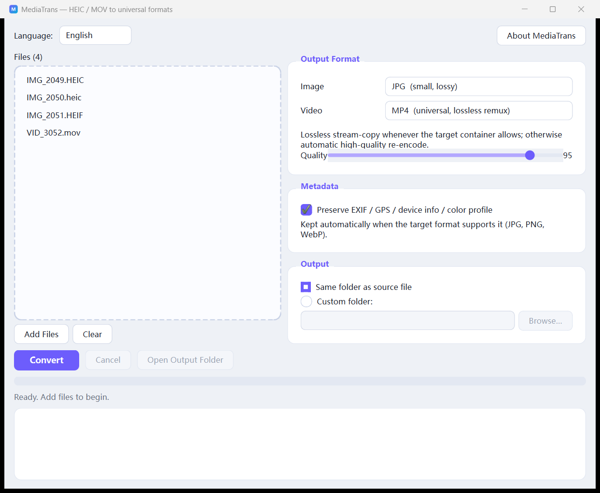
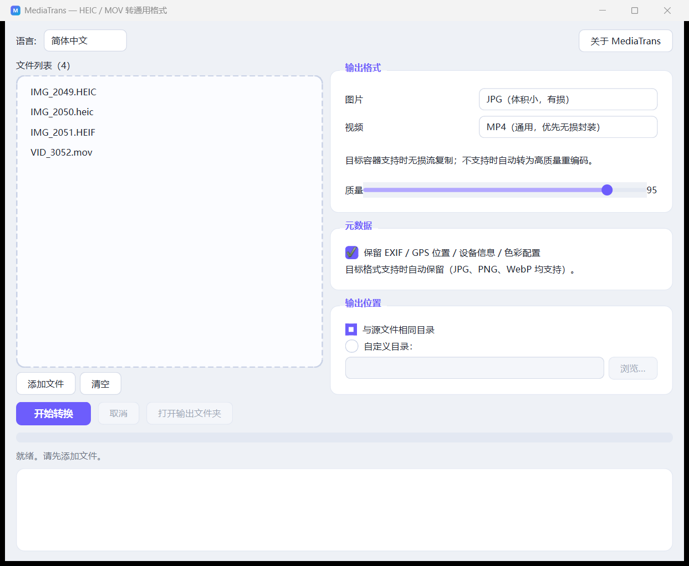

<div align="center">

# MediaTrans

**Convert Apple HEIC / MOV files to universal formats — with all metadata preserved.**

[中文说明](README.zh-CN.md) | English


[](https://github.com/Kelvin-LH/MediaTrans/actions/workflows/release.yml)

</div>

---

MediaTrans is a bilingual (English / 简体中文) desktop app that converts Apple's
proprietary **HEIC / HEIF photos** and **MOV videos** into the universal formats
**JPG / PNG / WebP / MP4**, while keeping everything the original file recorded:
EXIF, GPS location, device info (Make / Model / lens), capture time and the ICC
color profile.

| | |
|---|---|
|  |  |

## ✨ Features

- 🖼 **Images**: `HEIC / HEIF / HIF / AVIF / JPG / PNG / WebP / BMP / TIFF` → `JPG / PNG / WebP / AVIF / TIFF / BMP / PDF / GIF`
  - PNG, WebP-100, TIFF-LZW and BMP output are **pixel-lossless**
  - JPG saves at full quality (default 95, full 4:4:4 chroma at ≥90)
- 🎬 **Videos**: `MOV / QT / MP4 / M4V / AVI / MKV / WebM` → `MP4 / MKV / WebM / GIF / MP3`
  - **Lossless stream-copy remux** to MP4 / MKV whenever the codecs are container-compatible (H.264/HEVC + AAC — typical iPhone footage)
  - Automatic fallback to high-quality H.264 (CRF 18) for exotic codecs like ProRes; WebM uses VP9/Opus; MP3 extracts the audio track
- 📍 **Metadata preserved**: EXIF (capture time, ISO, exposure…), **GPS location**, **device info** (Apple / iPhone model), XMP and ICC color profile are copied into every output format that supports them
- 🌐 **Native bilingual UI**: English and 简体中文 built in, switchable at any time, auto-detected on first launch
- 🖱 **Drag & drop**, batch conversion with progress bar, per-file log, cancel anytime
- 📁 Output next to the source or to any custom folder; name conflicts are auto-suffixed
- 🧩 No external tools to install — the bundled static `ffmpeg` ships via pip

## 🚀 Getting started

**Download the prebuilt app** (no Python needed) from the
[Releases page](https://github.com/Kelvin-LH/MediaTrans/releases) —
Windows, macOS (Intel & Apple Silicon) and Linux builds are produced
automatically by CI on every version tag.

> Releases are unsigned unless the maintainer has configured code-signing
> certificates (`WINDOWS_CERT_B64`, `MACOS_CERT_B64` secrets). Your OS may
> show a SmartScreen/Gatekeeper warning — see the release notes for how to
> proceed.

Or run from source:

```bash
pip install -r requirements.txt
python run.py
```

Requirements: Python 3.10+. Works on Windows, macOS and Linux.

### Package a standalone executable (optional)

```bash
pip install pyinstaller
pyinstaller --noconfirm --windowed --name MediaTrans --collect-all pillow_heif run.py
```

## 📋 How it works

| Input | Output | Method | Lossless? |
|---|---|---|---|
| HEIC / HEIF / HIF / AVIF | PNG / BMP / TIFF-LZW | pixel-exact re-encode | ✅ yes |
| HEIC / HEIF / HIF / AVIF | WebP | lossless mode at quality 100 | ✅ yes |
| HEIC / HEIF / HIF / AVIF | JPG | high-quality encode (q95, 4:4:4) | ⚠️ best-possible for JPG |
| any supported image | PDF / GIF | document / 256-color output | ⚠️ content-preserving |
| MOV / QT / MP4 / AVI / MKV | MP4 | stream copy (`-c copy`) | ✅ yes, when codecs are MP4-compatible |
| MOV / QT / MP4 / AVI / MKV | MP4 | H.264 CRF 18 + AAC re-encode | ⚠️ fallback for ProRes etc. |
| MOV / QT / MP4 / AVI / MKV | MKV | stream copy | ✅ yes (Matroska accepts any codec) |
| MOV / QT / MP4 / AVI / MKV | WebM / GIF / MP3 | VP9+Opus / animated GIF / audio-only | ⚠️ re-encoded |

Metadata handling: EXIF (including the GPS IFD and the maker's device fields),
XMP and the ICC profile are read from the source and written into the output
whenever the container supports it. EXIF orientation is baked into the pixels so
the image looks right even in viewers that ignore orientation tags. You can also
turn metadata preservation off with one click (privacy mode).

> Note: JPG is inherently a lossy format — “lossless” applies to PNG / WebP-100
> and to the MP4 remux. For JPG we use the highest practical quality so the
> difference is imperceptible.

## ❓ FAQ

**Why can't I just rename .heic to .jpg?**
Renaming doesn't transcode or fix compatibility — the data is still HEVC-coded.
MediaTrans decodes and re-encodes properly while carrying the metadata over.

**Is my data uploaded anywhere?**
No. Everything runs locally on your machine.

**Why does my HEIC look rotated correctly in the output even though the original relied on an orientation flag?**
MediaTrans applies EXIF orientation at conversion time, so every viewer shows it correctly.

**Videos fail to convert?**
Make sure the `imageio-ffmpeg` package is installed (it is in `requirements.txt`).
It ships a static ffmpeg binary — no system installation needed.

## ⭐ Star History

[](https://star-history.com/#Kelvin-LH/MediaTrans&Date)

## 📄 License

[MIT](LICENSE)
