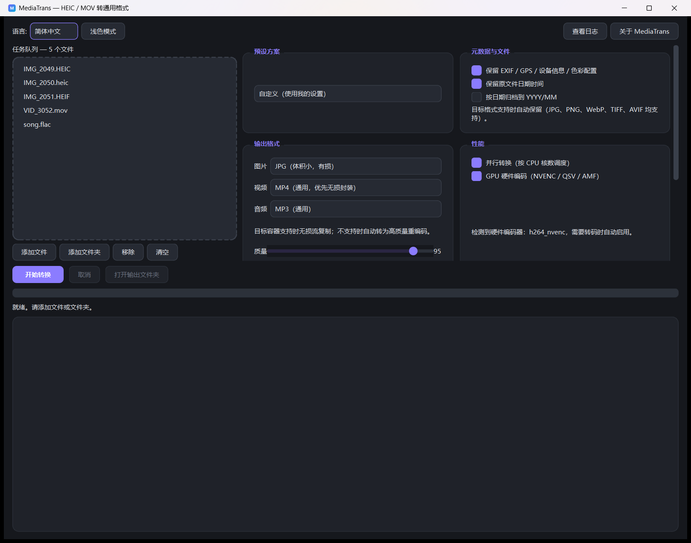

<div align="center">

# MediaTrans

**Convert Apple HEIC / MOV files to universal formats — with all metadata preserved.**

[中文说明](README.zh-CN.md) | English

[](https://github.com/Kelvin-LH/MediaTrans/actions/workflows/tests.yml)
[](https://github.com/Kelvin-LH/MediaTrans/actions/workflows/release.yml)
[](LICENSE)


</div>

---

MediaTrans converts Apple's proprietary **HEIC / HEIF photos** and **MOV videos**
into universal formats, keeping everything the original file recorded: EXIF, GPS
location, device info (make / model / lens), capture time and the ICC color
profile. It ships as a bilingual (English / 简体中文) desktop app **and** as a
scriptable command line tool.

| Light | Dark |
|---|---|
|  |  |

## ✨ Features

### Conversion
- 🖼 **Images**: `HEIC / HEIF / HIF / AVIF / JPG / PNG / WebP / BMP / TIFF` →
  `JPG / PNG / WebP / AVIF / TIFF / BMP / PDF / GIF`
  - PNG, WebP-100, TIFF-LZW and BMP output is **pixel-lossless**
  - JPG saves at full quality (default 95, full 4:4:4 chroma at ≥90)
- 🎬 **Videos**: `MOV / QT / MP4 / M4V / AVI / MKV / WebM` →
  `MP4 / MKV / WebM / GIF` plus audio extraction to `MP3 / M4A / WAV / FLAC / OGG`
  - **Lossless stream-copy remux** when the codecs are container-compatible
    (H.264/HEVC + AAC — typical iPhone footage)
  - Automatic fallback to GPU-accelerated or high-quality software encoding
    for exotic codecs such as ProRes
- 🎵 **Audio**: `MP3 / M4A / AAC / WAV / FLAC / OGG / OPUS` → `MP3 / M4A / WAV / FLAC / OGG`
- 📍 **Metadata preserved**: EXIF (capture time, ISO, exposure…), **GPS location**,
  **device info**, XMP and ICC profile, in every format that can store them
- 🔐 **Privacy mode**: strip all metadata with one click (`--no-metadata`)

### Workflow
- 📁 **Folders and drag & drop** — drop whole albums, scanned recursively
- 🎚 **Presets** — Web optimized, Social/email, Archive (lossless), Maximum
  compatibility, Smallest size
- 📐 **Resize** — cap the long edge, keeping aspect ratio, for images and video
- 🗓 **Organise by capture date** — write output into `YYYY/MM` folders
- ⚔️ **Conflict policy** — keep both / overwrite / skip
- 🕒 **Timestamp preservation** — outputs inherit the source file dates
- 📊 **Live summary** — size before/after, savings %, throughput, per-file deltas
- 🌐 **Bilingual UI** with **dark mode**, remembered between sessions
- 🖥 **Adaptive interface** — reflows from 780x460 up to 4K and renders cleanly
  at any DPI scale (100%–200%); window size and position are remembered
- 📜 **Diagnostics** — every conversion is logged with full tool output; one
  click opens the log, double-clicking a failure shows the raw error
- ⚡ **Parallel and GPU-accelerated** — jobs fan out across CPU cores, and
  NVENC / QSV / AMF / VideoToolbox are used automatically when available

## 🚀 Getting started

### Download the app

Grab the build for your platform from the
[Releases page](https://github.com/Kelvin-LH/MediaTrans/releases) —
Windows, macOS (Intel & Apple Silicon) and Linux packages are produced
automatically by CI on every version tag.

> Releases are unsigned unless the maintainer configured signing secrets
> (`WINDOWS_CERT_B64`, `MACOS_CERT_B64`). Your OS may show a SmartScreen or
> Gatekeeper warning — see the release notes for how to proceed. On macOS,
> right-click the app and choose **Open** the first time.

### Install with pip

```bash
pip install git+https://github.com/Kelvin-LH/MediaTrans.git
mediatrans --help          # command line
mediatrans-gui             # desktop app
```

### Run from source

```bash
pip install -r requirements.txt
python run.py              # desktop app
python -m app --help       # command line
```

Requirements: Python 3.10+ on Windows, macOS or Linux.

### Package a standalone executable

```bash
pip install pyinstaller
pyinstaller --noconfirm --windowed --name MediaTrans --icon MediaTrans.ico \
  --collect-all pillow_heif --collect-all imageio_ffmpeg run.py
```

## 🖥 Command line

The `mediatrans` command takes files *or folders* and converts everything it
finds. It is designed to be scriptable: exit code `0` when everything
succeeded, `1` when some files failed, `2` for usage errors.

```bash
# Convert a single photo, keeping metadata
mediatrans IMG_0001.heic -f webp -o converted/

# A whole iPhone album, resized and archived by capture date
mediatrans ~/Pictures/iPhone --resize 2560 --quality 88 --by-date -o ~/Pictures/web

# Videos to MP4 (lossless remux when possible)
mediatrans clip.mov -f mp4

# Extract audio from a video, or transcode audio
mediatrans interview.mov -f mp3
mediatrans album.flac -f m4a

# Preview without writing anything, then run it for real
mediatrans vacation/ -f jpg --dry-run
mediatrans vacation/ -f jpg -o out/ --skip-existing

# Machine-readable summary for scripts and CI
mediatrans photos/ -f avif --json | jq .converted

# Inspect metadata before converting
mediatrans info IMG_0001.heic
```

Useful flags:

| Flag | Meaning |
| --- | --- |
| `-f, --format` | Output format (`jpg` `png` `webp` `avif` `tiff` `bmp` `pdf` `gif` `mp4` `mkv` `webm` `mp3` `m4a` `wav` `flac` `ogg`) |
| `-o, --output` | Output folder (default: next to each source) |
| `-q, --quality` | Quality 1–100 for JPEG / WebP / AVIF |
| `--resize` | Cap the long edge in pixels |
| `--by-date` | Sort output into `YYYY/MM` from the capture date |
| `--no-metadata` | Strip EXIF / GPS / device info |
| `--no-timestamps` | Do not copy source file dates |
| `--conflict`, `--overwrite`, `--skip-existing` | What to do when the output exists |
| `--no-parallel`, `--jobs N` | Control parallelism |
| `--no-gpu` | Force software video encoding |
| `-n, --dry-run` | Show the plan, write nothing |
| `--json`, `--quiet`, `-v` | Output formatting |
| `--list-formats` | Supported formats, codecs and hardware capabilities |

## 📋 How it works

| Input | Output | Method | Lossless? |
|---|---|---|---|
| HEIC / HEIF / HIF / AVIF | PNG / BMP / TIFF-LZW | pixel-exact re-encode | ✅ yes |
| HEIC / HEIF / HIF / AVIF | WebP | lossless mode at quality 100 | ✅ yes |
| HEIC / HEIF / HIF / AVIF | JPG | high-quality encode (q95, 4:4:4) | ⚠️ best possible for JPG |
| any supported image | PDF / GIF | document / 256-color output | ⚠️ content preserving |
| MOV / QT / MP4 / AVI / MKV | MP4 | stream copy (`-c copy`) | ✅ yes, when codecs are MP4-compatible |
| MOV / QT / MP4 / AVI / MKV | MKV | stream copy | ✅ yes (Matroska accepts any codec) |
| MOV / QT / MP4 / AVI / MKV | MP4 / MKV | GPU or H.264 CRF 18 re-encode | ⚠️ fallback (ProRes, resizing, …) |
| MOV / QT / MP4 / AVI / MKV | WebM / GIF / audio | VP9+Opus / palette GIF / audio extraction | ⚠️ re-encoded |

**Metadata handling.** EXIF (including the GPS IFD and the device fields), XMP
and the ICC profile are read from the source and written into the output
whenever the container supports them. EXIF orientation is baked into the pixels
so the image looks right even in viewers that ignore orientation tags.

**A note on “lossless”.** JPG is inherently lossy and WebM/GIF require a
re-encode; for those we use the highest practical quality so differences are
imperceptible. The genuinely lossless paths are PNG, WebP-100, TIFF-LZW, BMP,
WAV/FLAC, and MP4/MKV remuxing.

## ⚙️ Notes and limitations

- **Spatial audio tracks** (`apac`) recorded by recent iPhones are not decodable
  by ffmpeg; MediaTrans maps the primary AAC track so conversion succeeds
  instead of failing on the unknown stream.
- **Live Photos** are treated as two independent files (a HEIC and a MOV with
  the same name) — both convert, and the pairing stays intact in the output
  names.
- **Multi-image HEIC** (bursts) exports the primary image.
- Resizing disables the MP4/MKV remux fast path, since scaling requires a
  re-encode.
- **Display requirements:** the window needs about 780x460 logical pixels. On
  smaller screens it still opens within the available area and every panel
  scrolls, but the interface becomes cramped.

## ❓ FAQ

**Why can't I just rename .heic to .jpg?**
Renaming doesn't transcode or fix compatibility — the data is still HEVC-coded.
MediaTrans decodes and re-encodes properly while carrying the metadata over.

**Is my data uploaded anywhere?**
No. Everything runs locally; there is no telemetry. See [SECURITY.md](SECURITY.md).

**My video failed to convert. How do I find out why?**
Open the log — it contains the exact ffmpeg output for the failure.
Windows: `%LOCALAPPDATA%\MediaTrans\logs\mediatrans.log`;
macOS / Linux: `~/MediaTrans/logs/mediatrans.log`.
In the GUI, use *View Log* or double-click the failed entry.

**Does it use my GPU?**
When a video has to be re-encoded, MediaTrans probes for NVENC, Quick Sync, AMF
and VideoToolbox and uses the first one available, falling back to software
x264 if the hardware path fails. Lossless remuxing needs no encoder at all.

**How many files can it handle at once?**
Thousands — jobs run in parallel with the worker count derived from your CPU
cores (2–8). `--jobs N` overrides it, `--no-parallel` serialises the batch.

## 🤝 Contributing

Contributions are welcome — see [CONTRIBUTING.md](CONTRIBUTING.md) for the
project layout, how to add a format, and the PR checklist.
Changes are tracked in [CHANGELOG.md](CHANGELOG.md).

## ⭐ Star History

[](https://star-history.com/#Kelvin-LH/MediaTrans&Date)

## 📄 License

[MIT](LICENSE)
